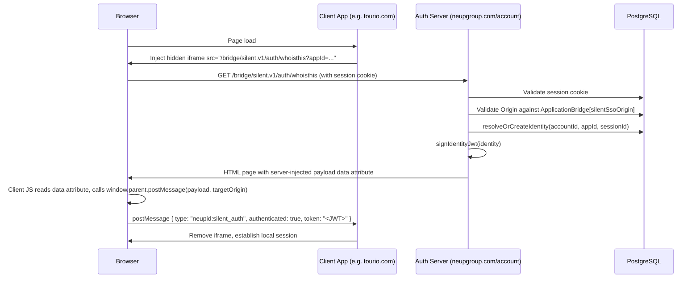
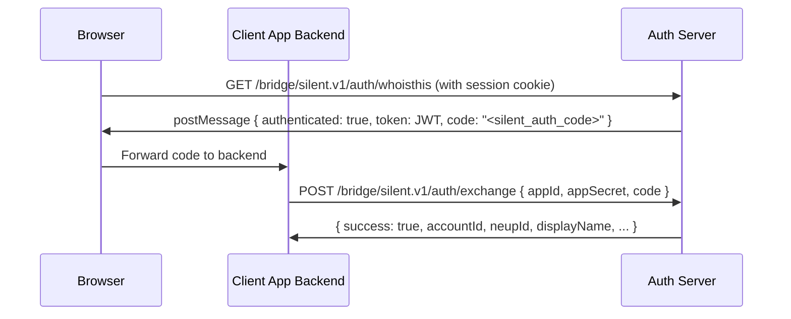
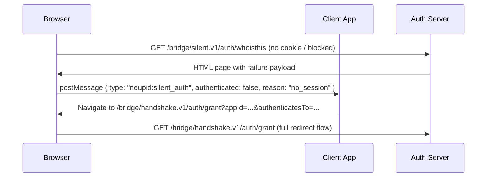

# Design Document: Silent SSO

## Overview

Silent SSO enables NeupID (the central identity provider at `neupgroup.com/account`) to silently authenticate users across registered third-party applications without showing a login screen. When a user is already signed in to any NeupID-connected app, another registered app can embed a hidden iframe pointing to the `whoisthis` endpoint. The auth server reads the session cookie, and if valid, returns a signed JWT via `postMessage`. The client app can then optionally exchange a short-lived authorization code server-to-server for a full user identity. If the silent check fails (no session, third-party cookie blocked, or unregistered origin), the system falls back to the existing redirect-based handshake flow.

This feature extends the existing `handshake.v1` and `api.v1/auth/whoami` infrastructure. It introduces:

- A new `whoisthis` iframe page (`app/bridge/silent.v1/auth/whoisthis/page.tsx`)
- A `postMessage`-based response protocol carrying a signed JWT
- A short-lived authorization code for optional server-to-server identity exchange
- A server-to-server code exchange endpoint (`app/bridge/silent.v1/auth/exchange/route.ts`)
- A new `Identity` Prisma model for stable, site-scoped identity tracking
- Application management UI additions for `silentSsoOrigin` registration
- In-memory rate limiting per origin

### Design Goals

- **Zero-redirect happy path**: authenticated users in supporting browsers get a JWT in the iframe without any visible navigation.
- **Graceful degradation**: unregistered origins, missing sessions, and ITP-blocked cookies all produce a well-typed failure payload that triggers the existing handshake fallback.
- **Minimal surface area**: the JWT carries only opaque identity fields (`ssid`, `sid`); no PII is transmitted via `postMessage`.
- **App-verifiable tokens**: JWTs are signed with the application's own `appSecret` (HS256), so each app can verify tokens independently without calling back to the auth server.

---

## Architecture

### Request Flow — Happy Path (Third-Party Cookies Allowed)



### Request Flow — Code Exchange Path (Optional Server-to-Server)



### Request Flow — Failure / ITP Fallback



### Component Map

```
app/
  bridge/
    silent.v1/
      auth/
        whoisthis/
          page.tsx          ← Next.js server component; renders iframe HTML with injected payload
        exchange/
          route.ts          ← POST handler; server-to-server code exchange

services/
  auth/
    silent-sso.ts           ← All Silent SSO business logic

app/(manage)/
  data/
    applications/
      _components/
        application-management-panel.tsx   ← Extended with silentSsoOrigin section
      [id]/
        silent-sso-origins/
          page.tsx          ← Dedicated management page for silentSsoOrigin entries

prisma/
  schema.prisma             ← New Identity model added
```

---

## Components and Interfaces

### `services/auth/silent-sso.ts`

The service layer owns all Silent SSO business logic. Route handlers and pages call into this service; they do not touch Prisma directly.

```typescript
// Validates an incoming origin against ApplicationBridge records of type 'silentSsoOrigin'.
// Matches by scheme + host only (ignoring path and query string).
export async function validateSilentSsoOrigin(
  origin: string
): Promise<{ valid: boolean; appId: string | null }>

// Looks up an existing Identity for (accountId, appId) or creates one.
// Sets validTill = now + 4 weeks, refreshesOn = now + 1 hour.
// Updates sessionId to the current session on each call.
export async function resolveOrCreateIdentity(
  accountId: string,
  appId: string,
  sessionId: string | null
): Promise<Identity>

// Signs a JWT with the application's appSecret (HS256).
// Payload: { ssid, sid, originated_on, refreshes_on, expires_on }
export async function signIdentityJwt(
  identity: Identity,
  appId: string
): Promise<string>

// Issues a short-lived silent_auth_code stored in AuthnRequest.
// Returns the code and the resolved Identity.
export async function issueSilentAuthCode(
  accountId: string,
  appId: string,
  sessionId: string
): Promise<{ code: string; identity: Identity }>

// Exchanges a silent_auth_code for a full user identity.
// Validates appId + appSecret, marks code as used, returns WhoAmI-style body.
export async function exchangeSilentAuthCode(
  appId: string,
  appSecret: string,
  code: string
): Promise<{ status: number; body: Record<string, unknown> }>

// In-memory rate limiter: 10 requests per origin per minute.
// Returns true if the request should be allowed, false if rate-limited.
export function checkRateLimit(origin: string): boolean
```

### `app/bridge/silent.v1/auth/whoisthis/page.tsx`

A Next.js **page** (not a route handler) because it must render an HTML document that runs client-side JavaScript to call `postMessage`. The server component reads the session cookie, validates the origin, resolves the identity, and injects the result as a `data-payload` attribute on a `<div>`. A small inline `<script>` reads that attribute and calls `window.parent.postMessage`.

Response headers set server-side via `next/headers`:
- `X-Frame-Options: ALLOWALL`
- `Content-Security-Policy: frame-ancestors *`
- `Referrer-Policy: no-referrer`

The page accepts optional query parameters:
- `appId` — used to look up the application when the origin alone is ambiguous (future-proofing)
- `codeChallenge` — PKCE challenge (S256)
- `codeChallengeMethod` — must be `S256` if provided

### `app/bridge/silent.v1/auth/exchange/route.ts`

A standard Next.js route handler (`POST`). Accepts JSON body `{ appId, appSecret, code, codeVerifier? }`. Rejects requests that carry a browser `Origin` header matching any registered `silentSsoOrigin` (server-to-server only). Delegates to `exchangeSilentAuthCode`.

### Application Management UI

A new `silentSsoOrigin` section is added to `ApplicationManagementPanel` (or a dedicated sub-page at `app/(manage)/data/applications/[id]/silent-sso-origins/page.tsx`). It renders the current list of registered origins and provides add/remove controls backed by new server actions in `services/applications/manage.ts`.

---

## Data Models

### New Prisma Model: `Identity`

```prisma
model Identity {
  id           String   @id @default(cuid())
  accountId    String?  @map("account_id")
  appId        String   @map("app_id")
  sessionId    String?  @map("session_id")
  originatedOn DateTime @default(now()) @map("originated_on")
  refreshesOn  DateTime @map("refreshes_on")
  validTill    DateTime @map("valid_till")

  account     Account?      @relation(fields: [accountId], references: [id])
  application Application   @relation(fields: [appId], references: [id])
  session     AuthnSession? @relation(fields: [sessionId], references: [id])

  @@unique([accountId, appId])
  @@map("identity")
}
```

The `@@unique([accountId, appId])` constraint enforces the "one stable identity per user per app" invariant at the database level. `resolveOrCreateIdentity` uses `upsert` against this constraint.

**Relation additions required on existing models:**

```prisma
// Add to model Account:
identities  Identity[]

// Add to model Application:
identities  Identity[]

// Add to model AuthnSession:
identities  Identity[]
```

### `AuthnRequest` — Reused for Silent Auth Codes

No schema change needed. Silent auth codes are stored as `AuthnRequest` records with:
- `type: "silent_auth_code"`
- `status: "pending"` → `"used"` on exchange
- `data: { appId, sessionId, codeChallenge?, codeChallengeMethod? }`
- `accountId`: the authenticated account
- `expiresAt`: `now + 300 seconds`

This mirrors the existing `bridge_grant` pattern in `services/auth/handshake.ts`.

### `ApplicationBridge` — Existing Model, New Entry Type

No schema change needed. Silent SSO origins are stored as `ApplicationBridge` records with `type: "silentSsoOrigin"` and `value: "<origin URL>"`. This is consistent with the existing `authenticatesTo` entries.

---

## API Design

### `GET /bridge/silent.v1/auth/whoisthis`

**Purpose:** Iframe-embeddable page that performs silent authentication and communicates the result via `postMessage`.

**Request:**
- Method: `GET`
- Headers: `Cookie` (session cookie, sent automatically by browser), `Origin` or `Referer` (used for origin validation)
- Query params: `appId?`, `codeChallenge?`, `codeChallengeMethod?`

**Response:** HTML page with response headers:
```
X-Frame-Options: ALLOWALL
Content-Security-Policy: frame-ancestors *
Referrer-Policy: no-referrer
```

**postMessage payloads dispatched by the page's inline script:**

Success:
```typescript
{
  type: "neupid:silent_auth",
  authenticated: true,
  token: "<HS256 JWT>",
  code: "<silent_auth_code>"   // present when a code was issued
}
```

Failure — no session:
```typescript
{
  type: "neupid:silent_auth",
  authenticated: false,
  reason: "no_session"
}
```

Failure — unregistered origin:
```typescript
{
  type: "neupid:silent_auth",
  authenticated: false,
  reason: "origin_not_registered"
}
```

Failure — session invalid/expired:
```typescript
{
  type: "neupid:silent_auth",
  authenticated: false,
  reason: "session_invalid"
}
```

Failure — rate limited:
```typescript
{
  type: "neupid:silent_auth",
  authenticated: false,
  reason: "rate_limited"
}
```

**`targetOrigin` for `postMessage`:** Always set to the exact registered `silentSsoOrigin` that matched the request's `Origin` header. Never `"*"`.

---

### `POST /bridge/silent.v1/auth/exchange`

**Purpose:** Server-to-server endpoint. Exchanges a `silent_auth_code` for a verified user identity.

**Request:**
```typescript
{
  appId: string;
  appSecret: string;
  code: string;
  codeVerifier?: string;   // required when PKCE was used at code issuance
}
```

**Success response (200):**
```typescript
{
  success: true,
  accountId: string,
  neupId: string | null,
  displayName: string | null,
  displayImage: string | null,
  accountType: string | null,
  verified: boolean
}
```

**Error responses:**

| Condition | Status | Body |
|---|---|---|
| Invalid/expired/used code | 400 | `{ success: false, error: "invalid_code" }` |
| appId mismatch | 400 | `{ success: false, error: "app_mismatch" }` |
| Wrong appSecret | 401 | `{ success: false, error: "unauthorized" }` |
| Browser origin detected | 403 | `{ success: false, error: "browser_origin_forbidden" }` |
| PKCE verification failed | 400 | `{ success: false, error: "invalid_code_verifier" }` |
| Missing required fields | 400 | `{ success: false, error: "invalid_request" }` |

**Browser origin rejection:** If the request includes an `Origin` header that matches any registered `silentSsoOrigin`, the endpoint returns 403. This prevents client-side JavaScript from calling the exchange endpoint directly.

---

## JWT Signing Strategy

JWTs are signed with **HS256** using the application's `appSecret` as the signing key. This allows each registered application to verify tokens independently without making a network call back to the auth server — consistent with the existing `bridgeIssueGrant` pattern in `services/auth/grant.ts`.

**JWT payload:**
```typescript
{
  ssid: string;          // Identity.id — stable, site-scoped identity token
  sid: string | null;    // Identity.sessionId — null if unauthenticated
  originated_on: string; // ISO 8601 — when the Identity record was first created
  refreshes_on: string;  // ISO 8601 — originated_on + 1 hour
  expires_on: string;    // ISO 8601 — Identity.validTill (originated_on + 4 weeks)
}
```

**Signing:**
```typescript
import jwt from 'jsonwebtoken'; // already installed

const token = jwt.sign(payload, application.appSecret, { algorithm: 'HS256' });
```

**Lifetime:** The JWT itself has no `exp` claim — the `expires_on` field in the payload is the canonical expiry, and the receiving application is responsible for checking it. This avoids clock-skew issues between the auth server and client apps.

**What the JWT does NOT contain:** `sessionKey`, raw `sessionId` (only the opaque `sid` reference), account PII (name, email, neupId). The exchange endpoint is the path to full identity data.

---

## Rate Limiting

Rate limiting is implemented as an in-memory `Map` keyed by origin, with a sliding window of 1 minute and a limit of 10 requests. This is intentionally simple — the auth server is a single Next.js process, and the rate limit is a DoS mitigation, not a billing control.

```typescript
// In services/auth/silent-sso.ts

type RateLimitEntry = { count: number; windowStart: number };
const rateLimitMap = new Map<string, RateLimitEntry>();
const RATE_LIMIT_MAX = 10;
const RATE_LIMIT_WINDOW_MS = 60_000;

export function checkRateLimit(origin: string): boolean {
  const now = Date.now();
  const entry = rateLimitMap.get(origin);

  if (!entry || now - entry.windowStart > RATE_LIMIT_WINDOW_MS) {
    rateLimitMap.set(origin, { count: 1, windowStart: now });
    return true;
  }

  if (entry.count >= RATE_LIMIT_MAX) {
    return false;
  }

  entry.count += 1;
  return true;
}
```

**Limitation:** This resets on server restart and does not share state across multiple instances. For multi-instance deployments, replace with a Redis-backed counter. The current design is acceptable for the initial rollout.

---

## Security Considerations

**Origin validation:** Every `whoisthis` request validates the `Origin` (or `Referer` as fallback) against `ApplicationBridge` records of type `silentSsoOrigin`. Matching is scheme + host only, consistent with the existing `whoami` origin-matching logic. Unregistered origins receive a failure payload and no code is issued.

**postMessage targetOrigin:** Always set to the exact registered origin, never `"*"`. This prevents a malicious page from intercepting the JWT by embedding the iframe from an unregistered origin.

**No PII in postMessage:** The JWT payload contains only opaque identifiers (`ssid`, `sid`) and timestamps. Account details (name, neupId, email) are only available via the server-to-server exchange endpoint.

**Single-use codes:** `silent_auth_code` records are atomically marked `"used"` on first exchange using `prisma.authnRequest.update({ where: { id, status: "pending" } })`. A second exchange attempt finds no `pending` record and returns `invalid_code`.

**Server-to-server only exchange:** The `/exchange` endpoint rejects any request whose `Origin` header matches a registered `silentSsoOrigin`. This prevents client-side JavaScript from calling the endpoint directly.

**HTTPS enforcement:** The `whoisthis` page and exchange endpoint are served exclusively over HTTPS (enforced by the Next.js deployment at `neupgroup.com/account`). HTTP requests are rejected at the infrastructure level.

**Session cookie attributes:** The session cookie must be set with `SameSite=None; Secure` to be sent in cross-site iframe requests in browsers that still permit third-party cookies. This is a deployment configuration concern.

**No session credential leakage:** `sessionKey` and raw `sessionId` are never included in any `postMessage` payload or exchange response. The `sid` field in the JWT is the `Identity.sessionId` (a database ID), not the session key.

**PKCE support:** When `codeChallenge` and `codeChallengeMethod=S256` are provided on the `whoisthis` URL, the challenge is stored in `AuthnRequest.data`. The exchange endpoint verifies `SHA256(base64url(codeVerifier)) === codeChallenge` before accepting the code.

**Audit logging:** All code issuance and exchange events are logged via the existing `logError` / activity logging infrastructure with `appId`, `origin`, and outcome. The code value itself is never logged.

**ITP / third-party cookie blocking:** Safari 17+, Brave, and Firefox with strict tracking protection block third-party cookies, so the iframe will not receive the session cookie. The `whoisthis` page returns `{ authenticated: false, reason: "no_session" }` in this case, and the client SDK falls back to the existing `handshake.v1` redirect flow.

---

## Correctness Properties

*A property is a characteristic or behavior that should hold true across all valid executions of a system — essentially, a formal statement about what the system should do. Properties serve as the bridge between human-readable specifications and machine-verifiable correctness guarantees.*

**PBT applicability assessment:** This feature contains pure service-layer functions (`signIdentityJwt`, `validateSilentSsoOrigin`, `resolveOrCreateIdentity`, `checkRateLimit`, `exchangeSilentAuthCode`) with clear input/output behavior and universal properties that hold across a wide input space. Property-based testing is appropriate for these functions. The iframe page rendering and management UI are excluded from PBT.

**Property reflection:** After reviewing all testable criteria, the following consolidations were made:
- Requirements 1.2 and 5.2/5.3 overlap on "JWT ssid equals Identity.id" — consolidated into Property 1.
- Requirements 5.4 and the `refreshesOn` ordering constraint are combined into Property 2 (temporal invariants).
- Requirements 3.1, 3.3, and 3.4 all test origin matching behavior — consolidated into Property 3.
- Requirements 4.6 and 4.7 both test code invalidation — consolidated into Property 5 (single-use enforcement).
- Requirements 7.3 and 7.4 test rate limiting and code binding — kept separate as they test distinct logic.

---

### Property 1: JWT round-trip preserves ssid

*For any* `Identity` record, signing it with `signIdentityJwt` and then decoding the resulting JWT must produce a payload where `ssid` equals `identity.id`, `sid` equals `identity.sessionId`, `originated_on` equals `identity.originatedOn.toISOString()`, `refreshes_on` equals `identity.refreshesOn.toISOString()`, and `expires_on` equals `identity.validTill.toISOString()`.

**Validates: Requirements 2.3, 5.3**

---

### Property 2: Identity temporal invariants

*For any* `Identity` record created by `resolveOrCreateIdentity`, `validTill` must equal `originatedOn + 4 weeks` (within 1 second tolerance), `refreshesOn` must be strictly after `originatedOn`, and `refreshesOn` must be strictly before `validTill`.

**Validates: Requirements 5.4, 2.3**

---

### Property 3: Origin validation correctness

*For any* set of registered `silentSsoOrigin` entries for an application, `validateSilentSsoOrigin` must return `{ valid: true, appId }` for any URL whose scheme and host match a registered entry (regardless of path or query string), and must return `{ valid: false, appId: null }` for any URL whose scheme and host do not match any registered entry.

**Validates: Requirements 3.1, 3.3, 3.4**

---

### Property 4: Identity idempotency (stable ssid)

*For any* `(accountId, appId)` pair, calling `resolveOrCreateIdentity` multiple times must always return an `Identity` record with the same `id` (the `ssid`). The identity is created on the first call and looked up on subsequent calls — the `ssid` never changes for a given `(accountId, appId)` pair.

**Validates: Requirements 5.2**

---

### Property 5: Silent auth code single-use enforcement

*For any* valid `silent_auth_code` issued by `issueSilentAuthCode`, the first call to `exchangeSilentAuthCode` with the correct `appId` and `appSecret` must succeed, and any subsequent call with the same code must return `{ success: false, error: "invalid_code" }`.

**Validates: Requirements 4.6, 4.7**

---

### Property 6: Code is bound to its issuing appId

*For any* `silent_auth_code` issued for application A, calling `exchangeSilentAuthCode` with a different application B's `appId` (even with B's correct `appSecret`) must return `{ success: false, error: "app_mismatch" }`.

**Validates: Requirements 7.4**

---

### Property 7: Rate limit enforcement

*For any* origin, after exactly 10 calls to `checkRateLimit` within a 1-minute window, the 11th call must return `false`. After the window resets (1 minute elapses), the counter resets and the next call must return `true`.

**Validates: Requirements 7.3**

---

### Property 8: JWT payload contains no session credentials

*For any* `Identity` record and any `appSecret`, the JWT produced by `signIdentityJwt` must not contain the fields `sessionKey`, `skey`, `key`, `password`, or any field whose value equals the raw `appSecret`. The payload must contain exactly and only `{ ssid, sid, originated_on, refreshes_on, expires_on }`.

**Validates: Requirements 7.2**

---

## Error Handling

| Scenario | Service behavior | HTTP response |
|---|---|---|
| Origin not registered | `validateSilentSsoOrigin` returns `{ valid: false }` | Page renders failure payload; no code issued |
| No session cookie | `getSessionCookies()` returns empty strings | Page renders `{ reason: "no_session" }` |
| Session expired or key mismatch | `resolveWhoAmI` returns 401 | Page renders `{ reason: "session_invalid" }` |
| Rate limit exceeded | `checkRateLimit` returns `false` | Page renders `{ reason: "rate_limited" }` |
| Invalid/used/expired code | `prisma.authnRequest.update` throws (no pending record) | Exchange returns 400 `invalid_code` |
| appId mismatch on exchange | Code's stored `appId` ≠ request `appId` | Exchange returns 400 `app_mismatch` |
| Wrong appSecret on exchange | `application.appSecret !== appSecret` | Exchange returns 401 `unauthorized` |
| Browser origin on exchange | Request `Origin` matches a `silentSsoOrigin` | Exchange returns 403 `browser_origin_forbidden` |
| PKCE verification failure | `SHA256(codeVerifier) !== codeChallenge` | Exchange returns 400 `invalid_code_verifier` |
| Database error | Caught, logged via `logError` | Page renders failure payload; exchange returns 500 |

All errors in the `whoisthis` page are handled gracefully — the page always renders and always dispatches a `postMessage`. It never returns a 4xx/5xx HTTP status to the browser, because that would prevent the iframe from loading and the client SDK would time out rather than receiving a typed failure.

---

## Testing Strategy

### Unit Tests

Unit tests cover specific examples, edge cases, and error conditions in the service layer.

- `validateSilentSsoOrigin`: registered origin matches, unregistered origin rejected, path/query ignored, multiple origins per app
- `resolveOrCreateIdentity`: creates new record, returns existing record on second call, sets correct timestamps
- `signIdentityJwt`: payload shape, HS256 algorithm, no extra fields
- `issueSilentAuthCode`: code length ≥ 64 chars, expiry = now + 300s, data fields stored correctly
- `exchangeSilentAuthCode`: happy path, expired code, used code, wrong appId, wrong appSecret, PKCE verification
- `checkRateLimit`: allows first 10, blocks 11th, resets after window

### Property-Based Tests

Property-based tests use `fast-check` (already installed). Each test runs a minimum of 100 iterations.

**Tag format:** `// Feature: silent-sso, Property {N}: {property_text}`

| Property | Test description | Arbitraries |
|---|---|---|
| P1: JWT round-trip | Generate random Identity-shaped objects, sign, decode, assert field equality | `fc.record({ id: fc.string(), sessionId: fc.option(fc.string()), ... })` |
| P2: Temporal invariants | Generate random `originatedOn` dates, create Identity, assert timing constraints | `fc.date()` |
| P3: Origin validation | Generate random origin sets and test URLs, assert match/no-match | `fc.webUrl()`, `fc.array(fc.webUrl())` |
| P4: Identity idempotency | Generate random (accountId, appId) pairs, call twice, assert same id | `fc.string()`, `fc.string()` |
| P5: Single-use codes | Issue a code, exchange once (success), exchange again (invalid_code) | `fc.string()` for accountId/appId |
| P6: Code-appId binding | Issue code for appId A, exchange with appId B, assert app_mismatch | `fc.string()` for appIds |
| P7: Rate limit | Call checkRateLimit 11 times for same origin, assert 11th returns false | `fc.webUrl()` for origin |
| P8: No credentials in JWT | Generate Identity, sign JWT, decode, assert forbidden fields absent | `fc.record(...)` |

### Integration Tests

- Origin add/remove reflected on next request (no caching)
- Session invalidation cascades to outstanding codes
- Full iframe → postMessage → exchange flow end-to-end

### Migration

A new Prisma migration is required to:
1. Create the `identity` table with all columns and constraints
2. Add the `@@unique([account_id, app_id])` index
3. Add the `identities` relation back-references on `Account`, `Application`, and `AuthnSession`

Run with:
```bash
npx prisma migrate dev --name add_identity_table
```

The migration is non-destructive — it only adds a new table and relation fields. No existing data is modified.
